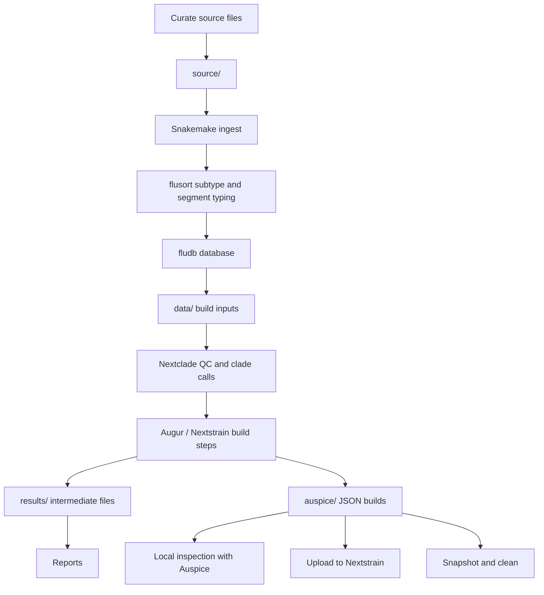
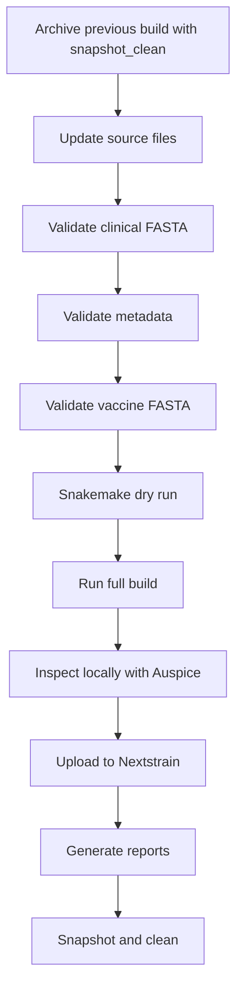

## What you will learn

By the end of this tutorial, you should be able to:

- Prepare the required input files for the Pekosz Lab influenza Nextstrain pipeline
- Understand how `source/`, `data/`, `results/`, and `auspice/` are used
- Run the full Snakemake workflow
- Inspect the resulting builds locally
- Upload builds to Nextstrain
- Generate reports
- Archive and clean a completed build

::: {.callout-important}
The most manual and error-prone part of this workflow is **curating the initial source data**, especially `vaccines.fasta`.
:::

---

## What this pipeline builds

This repository builds seasonal influenza Nextstrain trees for:

| Virus group | Builds |
|---|---|
| H1N1 | 8 segment builds + 1 concatenated genome build |
| H3N2 | 8 segment builds + 1 concatenated genome build |
| B/Victoria | 8 segment builds + 1 concatenated genome build |

Total:

```text
24 segment builds + 3 concatenated genome builds = 27 builds
```

---

## Big-picture workflow



---

## Repository assumptions

This tutorial assumes:

1. You have access to the private or internal source data.
2. You have permission to use GISAID data.
3. You are running commands from the repository root:

```text
nextstrain/
```

::: {.callout-warning}
All commands in this tutorial should be run from the `nextstrain/` repository directory unless otherwise stated.
:::

---

## Tools you need

##### Required:

- `git`
- Nextstrain CLI
- A working Nextstrain runtime, preferably Docker
- Snakemake, provided through the Nextstrain runtime
- Python, provided through the Nextstrain runtime
- Quarto, for report rendering
- Access to GISAID, using your own credentials
- Access to JHH source data, if authorized

##### Recommended:

- Positron, VS Code, or another code editor
- Snakemake syntax extension
- SQLite viewer extension for inspecting `fludb.db`

---

## Install or verify Nextstrain

Install Nextstrain using the official documentation:

<https://docs.nextstrain.org/en/latest/install.html>

The recommended runtime for most users is:

- Docker on macOS
- Docker or WSL2 on Windows
- Docker or native Conda on Linux

After installation, verify your setup:

```bash
nextstrain check-setup
```

---

## Clone the repository

From a local directory where you want the repository to live:

```bash
git clone https://github.com/Pekosz-Lab/nextstrain.git
```

Move into the repository:

```bash
cd nextstrain
```

Confirm you are in the correct place:

```bash
pwd
ls
```

You should see files such as:

```text
Snakefile
config.yaml
workflow/
scripts/
fludb/
```

---

## Enter the Nextstrain runtime

From inside the repository:

```bash
nextstrain shell .
```

You should see something similar to:

```text
Entering the Nextstrain runtime (docker)

Mapped volumes:
  /nextstrain/build is from /path/to/your/local/nextstrain

Run the command "exit" to leave the runtime.
```

::: {.callout-tip}
Once inside the runtime, run the rest of the build commands from this shell.
:::

---

## Directory structure before adding data

After cloning, the repository has code but not private data.

You will create three working directories:

```bash
mkdir -p source data results
```

Expected structure:

```text
nextstrain/
├── source/
├── data/
├── results/
├── workflow/
├── scripts/
├── fludb/
├── Snakefile
└── config.yaml
```

---

## The three critical source files

The pipeline expects these main files in `source/`:

```text
source/
├── JHH_sequences.fasta
├── JHH_metadata.tsv
└── vaccines.fasta
```

Some workflows may also include:

```text
source/
└── vaccines.tsv
```

The most important files to curate correctly are:

1. `JHH_sequences.fasta`
2. `JHH_metadata.tsv`
3. `vaccines.fasta`

---

## Why source-data curation matters

The Snakemake workflow automates many downstream steps:

- Segment typing
- Subtyping
- Database upload
- Dataset creation
- Filtering
- Nextclade QC
- Tree building
- Auspice export

But it assumes that the input files are valid.

If source files are misformatted, the pipeline may:

- Fail during ingest
- Assign wrong segments
- Drop sequences unexpectedly
- Mislabel vaccine strains
- Produce incorrect metadata
- Generate incomplete builds

---

# Part 1: Curating JHH clinical sequence data

---

## `JHH_sequences.fasta`

`JHH_sequences.fasta` contains nucleotide sequences for influenza genome segments.

Each FASTA record should represent **one genome segment**.

The header format is:

```text
>sequence_ID_segmentNumber
```

Example:

```text
>JH23840_1
ATGGAGAGAATAAAAGAGCTAAGAGACCTAATGTCGCAGTCCCGCACTCGCGAGATACTC...
>JH23840_2
ATGGAGAGAATAAAAGAGCTAAGAGACCTAATGTCGCAGTCCCGCACTCGCGAGATACTC...
>JH23840_3
ATGGAGAGAATAAAAGAGCTAAGAGACCTAATGTCGCAGTCCCGCACTCGCGAGATACTC...
>JH23840_4
ATGGAGAGAATAAAAGAGCTAAGAGACCTAATGTCGCAGTCCCGCACTCGCGAGATACTC...
```

---

## Clinical FASTA header anatomy

For this header:

```text
>JH23840_4
```

The meaning is:

| Component | Meaning |
|---|---|
| `>` | FASTA header marker |
| `JH23840` | `sequence_ID` |
| `_` | Separator |
| `4` | Segment number |

The `sequence_ID` must match a row in:

```text
source/JHH_metadata.tsv
```

---

## Segment numbering: influenza A

For H1N1 and H3N2, the segment numbering is:

| Segment number | Gene segment |
|---:|---|
| 1 | PB2 |
| 2 | PB1 |
| 3 | PA |
| 4 | HA |
| 5 | NP |
| 6 | NA |
| 7 | MP |
| 8 | NS |

Example:

```text
>JH23840_4
```

means H1N1 or H3N2 HA.

---

## Segment numbering: influenza B

For B/Victoria, the segment numbering is:

| Segment number | Gene segment |
|---:|---|
| 1 | PB1 |
| 2 | PB2 |
| 3 | PA |
| 4 | HA |
| 5 | NP |
| 6 | NA |
| 7 | MP |
| 8 | NS |

::: {.callout-warning}
Segment `1` and segment `2` are ordered differently for influenza A and influenza B in this workflow.
:::

---

## Why influenza B numbering differs

For influenza B virus, the numbering reflects the GenBank reference convention used upstream during genome assembly.

Therefore:

```text
JH23840_1
```

means:

| Virus type | Segment |
|---|---|
| Influenza A | PB2 |
| Influenza B | PB1 |

But:

```text
JH23840_4
```

means HA for both influenza A and B.

---

## Clinical FASTA checklist

Before running the workflow, check that:

- Every header starts with `>`
- Every header contains exactly one final underscore before the segment number
- The segment number is between `1` and `8`
- The sequence ID before the underscore exists in `JHH_metadata.tsv`
- Sequences contain nucleotide characters, not amino acids
- There are no spaces in the clinical FASTA headers
- There are no duplicate headers
- Empty records are removed
- Failed controls such as NTCs are either removed or intentionally handled

---

## Inspect clinical FASTA headers

From the repository root:

```bash
grep "^>" source/JHH_sequences.fasta | head
```

Count records:

```bash
grep -c "^>" source/JHH_sequences.fasta
```

Inspect unique segment numbers:

```bash
grep "^>" source/JHH_sequences.fasta \
  | sed 's/^>//' \
  | awk -F'_' '{print $NF}' \
  | sort \
  | uniq -c
```

You should generally see segment numbers `1` through `8`.

---

## Look for malformed clinical headers

This command prints headers whose final field is not a number from 1 to 8:

```bash
grep "^>" source/JHH_sequences.fasta \
  | sed 's/^>//' \
  | awk -F'_' '$NF !~ /^[1-8]$/ {print}'
```

If this prints anything, inspect those records manually.

---

## Check for duplicate clinical FASTA headers

```bash
grep "^>" source/JHH_sequences.fasta \
  | sort \
  | uniq -d
```

Expected result:

```text
# no output
```

If duplicate headers appear, fix them before running the pipeline.

---

## `JHH_metadata.tsv`

`JHH_metadata.tsv` is a tab-delimited file with one row per sample.

Required columns:

```text
sequence_ID	sample_ID	sequencing_run	date	passage_history
```

Example:

```text
sequence_ID	sample_ID	sequencing_run	date	passage_history
JH23595	JH23595	IV23Run6	2023-11-13	vtm
JH23840	JH23840	IV23Run7	2023-12-01	vtm
```

---

## Metadata column meanings

| Column | Meaning |
|---|---|
| `sequence_ID` | Unique identifier matching FASTA headers before `_segmentNumber` |
| `sample_ID` | Original sample ID; may equal `sequence_ID` |
| `sequencing_run` | Sequencing run name or ID |
| `date` | Collection or processing date in `YYYY-MM-DD` format |
| `passage_history` | Sample or passage history, for example `vtm` |

---

## Metadata checklist

Before running the workflow, confirm:

- File is tab-delimited, not comma-delimited
- Required columns are present
- `sequence_ID` values match FASTA sequence IDs
- Dates use `YYYY-MM-DD`
- No blank `sequence_ID` values
- No duplicate `sequence_ID` rows unless intentionally supported
- Passage history is consistently recorded
- Control samples are excluded unless intentionally included

---

## Inspect metadata

Show the first few rows:

```bash
head source/JHH_metadata.tsv
```

Show the column names:

```bash
head -n 1 source/JHH_metadata.tsv | tr '\t' '\n'
```

Count metadata rows:

```bash
tail -n +2 source/JHH_metadata.tsv | wc -l
```

---

## Check date format

This command prints rows where the `date` column does not look like `YYYY-MM-DD`.

Assuming `date` is column 4:

```bash
awk -F'\t' 'NR > 1 && $4 !~ /^[0-9]{4}-[0-9]{2}-[0-9]{2}$/ {print}' \
  source/JHH_metadata.tsv
```

Expected result:

```text
# no output
```

---

## Check FASTA IDs against metadata IDs

Extract FASTA sample IDs:

```bash
grep "^>" source/JHH_sequences.fasta \
  | sed 's/^>//' \
  | sed 's/_[1-8]$//' \
  | sort -u > /tmp/fasta_ids.txt
```

Extract metadata IDs:

```bash
tail -n +2 source/JHH_metadata.tsv \
  | cut -f1 \
  | sort -u > /tmp/metadata_ids.txt
```

Find FASTA IDs missing from metadata:

```bash
comm -23 /tmp/fasta_ids.txt /tmp/metadata_ids.txt
```

Expected result:

```text
# no output
```

---

## Find metadata IDs without sequences

```bash
comm -13 /tmp/fasta_ids.txt /tmp/metadata_ids.txt
```

This may be acceptable if metadata includes samples that failed sequencing.

However, review the output.

---

# Part 2: Curating vaccine sequences from GISAID

---

## Why vaccine curation is special

Clinical sequence headers use this simple format:

```text
>sequence_ID_segmentNumber
```

But vaccine headers use a richer GISAID-derived format:

```text
>Isolate name-Passage details/history | Isolate ID | Collection date | Passage details/history | Segment number | Type | Lineage
```

::: {.callout-danger}
Do not format vaccine headers like clinical headers.  
The vaccine ingest script expects the pipe-delimited format.
:::

---

## Where vaccine sequences come from

Vaccine sequences are manually downloaded from GISAID.

General process:

1. Log in to GISAID with your own credentials.
2. Navigate to vaccine reference sequences.
3. Select the vaccine strains and segments.
4. Download FASTA sequences.
5. Manually reformat every FASTA header.
6. Save the final file as:

```text
source/vaccines.fasta
```

---

## GISAID data-use warning

::: {.callout-warning}
GISAID requires individual credentials.

Do not:

- Share your credentials
- Commit downloaded GISAID data to a public repository
- Redistribute GISAID sequences outside allowed terms
- Include private JHH data in public outputs
:::

---

## Recommended GISAID workset

In GISAID, create a workset named:

```text
seasonal influenza vaccine strains
```

This helps you:

- Track selected vaccine strains
- Download multiple segments together
- Avoid missing segments
- Update future builds more consistently

---

## Add vaccine strains to the workset

For each vaccine strain:

1. Open the strain or accession page.
2. Locate the sequence section.
3. Select all available segments.
4. Click **Copy to**.
5. Add the selected sequences to:

```text
seasonal influenza vaccine strains
```

::: {.callout-tip}
Influenza has 8 genome segments. Include all available segments when possible.
:::

---

## Download vaccine FASTA

After building the workset:

1. Open the workset.
2. Confirm the expected strains are present.
3. Confirm expected segments are present.
4. Download the sequences in FASTA format.
5. Save a working copy outside the repository or in a temporary location.
6. Reformat headers before copying into `source/vaccines.fasta`.

---

## Required vaccine FASTA header format

Every vaccine FASTA header must have exactly seven fields:

```text
>Isolate name-Passage details/history | Isolate ID | Collection date | Passage details/history | Segment number | Type | Lineage
```

Fields are separated by pipe characters:

```text
|
```

Spaces around pipes are allowed and recommended.

---

## Vaccine header fields

| Field | Example | Notes |
|---:|---|---|
| 1 | `A/Wisconsin/67/2022-E2/E3` | Isolate name plus passage |
| 2 | `EPI_ISL_XXXXXXXX` | GISAID isolate ID |
| 3 | `2022-03-15` | Collection date |
| 4 | `E2/E3` | Passage history |
| 5 | `4` | Segment number |
| 6 | `A` | Type |
| 7 | `H1N1` | Lineage or subtype |

---

## Example vaccine record

```text
>A/Wisconsin/67/2022-E2/E3 | EPI_ISL_XXXXXXXX | 2022-03-15 | E2/E3 | 4 | A | H1N1
ATG...TAA
```

::: {.callout-note}
Use the real isolate name, isolate ID, date, passage, segment, type, and lineage from GISAID.
:::

---

## Passage appears twice on purpose

The first field should include passage history appended to the isolate name:

```text
A/Wisconsin/67/2022-E2/E3
```

The fourth field should contain the passage history again:

```text
E2/E3
```

This duplication is intentional.

::: {.callout-important}
Do not remove passage history from the vaccine strain name.
:::

---

## Vaccine header examples

Correct:

```text
>A/Wisconsin/67/2022-E2/E3 | EPI_ISL_123456 | 2022-03-15 | E2/E3 | 4 | A | H1N1
```

Incorrect: missing passage in strain name

```text
>A/Wisconsin/67/2022 | EPI_ISL_123456 | 2022-03-15 | E2/E3 | 4 | A | H1N1
```

Incorrect: wrong delimiter

```text
>A/Wisconsin/67/2022-E2/E3, EPI_ISL_123456, 2022-03-15, E2/E3, 4, A, H1N1
```

Incorrect: missing fields

```text
>A/Wisconsin/67/2022-E2/E3 | EPI_ISL_123456 | 4 | H1N1
```

---

## Vaccine curation checklist

Before saving `source/vaccines.fasta`, confirm:

- Every record starts with `>`
- Every header contains exactly 7 pipe-delimited fields
- Segment number is present
- Segment number is between `1` and `8`
- Type is included, for example `A` or `B`
- Lineage is included, for example `H1N1`, `H3N2`, or `Victoria`
- Collection date is present
- Passage history appears in field 1 and field 4
- No duplicate headers
- No non-sequence text remains from the GISAID download

---

## Save the final vaccine file

After manual reformatting:

```text
source/vaccines.fasta
```

Confirm it exists:

```bash
ls -lh source/vaccines.fasta
```

Preview headers:

```bash
grep "^>" source/vaccines.fasta | head
```

Count vaccine records:

```bash
grep -c "^>" source/vaccines.fasta
```

---

## Check vaccine header field count

This command prints vaccine headers that do not have seven pipe-delimited fields:

```bash
grep "^>" source/vaccines.fasta \
  | awk -F'|' 'NF != 7 {print "Bad header:", $0}'
```

Expected result:

```text
# no output
```

---

## Check vaccine segment numbers

```bash
grep "^>" source/vaccines.fasta \
  | awk -F'|' '{
      gsub(/ /, "", $5);
      if ($5 !~ /^[1-8]$/) print "Bad segment:", $0
    }'
```

Expected result:

```text
# no output
```

---

## Check vaccine type and lineage fields

```bash
grep "^>" source/vaccines.fasta \
  | awk -F'|' '{
      type=$6; lineage=$7;
      gsub(/^ +| +$/, "", type);
      gsub(/^ +| +$/, "", lineage);
      if (type == "" || lineage == "") print "Missing type/lineage:", $0
    }'
```

Expected result:

```text
# no output
```

---

# Part 3: Organizing the project before the build

---

## Expected project structure

Before running Snakemake, your repository should look like:

```text
nextstrain/
├── source/
│   ├── JHH_metadata.tsv
│   ├── JHH_sequences.fasta
│   ├── vaccines.fasta
│   └── vaccines.tsv              # optional / if present
├── data/
├── results/
├── workflow/
├── scripts/
├── fludb/
├── Snakefile
└── config.yaml
```

---

## Confirm required files

Run:

```bash
ls -lh source/
```

You should see at minimum:

```text
JHH_metadata.tsv
JHH_sequences.fasta
vaccines.fasta
```

You can also test directly:

```bash
test -s source/JHH_metadata.tsv && echo "metadata OK"
test -s source/JHH_sequences.fasta && echo "clinical sequences OK"
test -s source/vaccines.fasta && echo "vaccines OK"
```

---

## What `source/` is for

`source/` contains manually curated input data.

It should include:

- Clinical sequence FASTA
- Clinical metadata TSV
- Vaccine/reference FASTA
- Optional vaccine metadata files, if used

These files are the source of truth for the build.

::: {.callout-warning}
Do not edit generated files in `data/` or `results/` to fix source-data problems.  
Fix the files in `source/`, then rerun the workflow.
:::

---

## What `data/` is for

`data/` is generated by the pipeline.

It contains build-specific datasets produced from the ingest database.

You generally do not manually edit this directory.

If source data change, regenerate `data/` through Snakemake.

---

## What `results/` is for

`results/` contains intermediate and final build files for each subtype and segment.

Examples may include:

```text
results/h1n1/ha/
results/h3n2/ha/
results/vic/ha/
```

These are generated by the pipeline.

---

## What `auspice/` is for

`auspice/` contains JSON files that can be viewed by Auspice or uploaded to Nextstrain.

Example:

```text
auspice/
├── h1n1_ha.json
├── h3n2_ha.json
└── vic_ha.json
```

Exact filenames depend on the pipeline configuration.

---

# Part 4: Running Snakemake

---

## What Snakemake does here

Snakemake executes the build as a dependency graph.

The workflow can:

- Ingest source data
- Type and subtype sequences with `flusort`
- Upload records into `fludb`
- Generate build-specific datasets
- Run Nextclade
- Filter sequences
- Align sequences
- Build and refine trees
- Export Auspice JSON files

---

## First: dry run

Before running the full build, perform a dry run:

```bash
snakemake --dry-run --cores 8
```

or shorter:

```bash
snakemake -n --cores 8
```

A dry run shows what Snakemake plans to do without executing commands.

---

## Full build command

From the repository root, inside the Nextstrain runtime:

```bash
snakemake --cores 8
```

This builds all configured targets.

::: {.callout-tip}
Use a core count appropriate for your machine.  
For laptops, `--cores 4` or `--cores 8` is usually reasonable.
:::

---

## Common Snakemake options

| Option | Meaning |
|---|---|
| `--cores 8` | Use up to 8 CPU cores |
| `--dry-run` or `-n` | Show planned jobs without running |
| `--printshellcmds` or `-p` | Print shell commands as they run |
| `--rerun-incomplete` | Rerun jobs that were interrupted |
| `--keep-going` | Continue independent jobs after an error |
| `--reason` | Explain why jobs are being run, depending on Snakemake version |

Useful build command:

```bash
snakemake --cores 8 --printshellcmds --rerun-incomplete
```

---

## What happens during ingest

The ingest workflow automates tasks that previously required manual organization.

It does the following:

1. Reads `source/JHH_sequences.fasta`
2. Reads `source/JHH_metadata.tsv`
3. Reads `source/vaccines.fasta`
4. Runs segment typing and subtyping using `flusort`
5. Uploads genomes and metadata to `fludb`
6. Includes vaccine strains in the database
7. Generates build datasets in `data/`

---

## The database: `fludb.db`

During ingest, the workflow creates:

```text
fludb.db
```

This SQLite database stores organized influenza sequence and metadata records.

You can inspect it with:

- SQLite command-line tools
- A SQLite viewer extension in your editor
- Custom scripts in the repository

::: {.callout-note}
Most users do not need to manually edit `fludb.db`.
:::

---

## Generated build inputs

After ingest, the pipeline creates files in:

```text
data/
```

These are used as inputs for the downstream Nextstrain builds.

The exact structure may vary, but it should contain subtype- and segment-specific datasets.

---

## Nextclade and QC

The pipeline automatically uses Nextclade for clade calls and QC metrics.

Nextclade provides:

- Clade/subclade assignment
- Missing data metrics
- Private mutations
- Mutation clusters
- Frameshift checks
- Stop codon checks
- Overall QC status
- Glycosylation predictions, where applicable

---

## Filtering logic

The workflow filters sequences using criteria such as:

```python
(coverage >= 0.9) & (`qc.overallStatus` == 'good')
```

and segment-specific minimum lengths.

::: {.callout-note}
If you need to include `mediocre` QC sequences, the workflow filtering logic would need to be adjusted intentionally.
:::

---

## Standard Nextstrain build steps

After filtering, the workflow runs typical Nextstrain steps:

1. Align sequences
2. Build a raw tree
3. Refine the tree
4. Annotate metadata traits
5. Infer ancestral sequences
6. Translate sequences
7. Export Auspice v2 JSON
8. Prepare builds for viewing or upload

---

# Part 5: Monitoring and troubleshooting

---

## If the build succeeds

You should see output directories such as:

```text
data/
results/
auspice/
logs/
```

Check:

```bash
ls -lh auspice/
```

You should see JSON files for the builds.

---

## If the build fails

Read the error message carefully.

Common failure points:

- Missing `source/` files
- Malformed FASTA headers
- Metadata ID mismatch
- Vaccine headers not pipe-delimited correctly
- Invalid dates
- Duplicate sequence IDs
- Interrupted or incomplete Snakemake jobs
- Docker file-sharing issues
- Insufficient disk space or memory

---

## Rerun after an interrupted build

If the build was interrupted, use:

```bash
snakemake --cores 8 --rerun-incomplete
```

If you want more verbose command output:

```bash
snakemake --cores 8 --rerun-incomplete --printshellcmds
```

---

## Clean generated files manually?

Avoid manually deleting random files unless you understand the dependency graph.

Safer options:

1. Fix source data.
2. Rerun Snakemake.
3. Use the provided `snapshot_clean` rule after a completed build.

---

## Generate a rulegraph

To visualize the workflow:

```bash
snakemake --rulegraph | dot -Tpng > rulegraph.png
```

Then open:

```text
rulegraph.png
```

::: {.callout-note}
You need Graphviz installed for the `dot` command.
:::

---

# Part 6: Viewing builds locally

---

## View with Auspice

Before uploading, inspect the builds locally.

For H1N1:

```bash
auspice view --datasetDir auspice/h1n1
```

For H3N2:

```bash
auspice view --datasetDir auspice/h3n2
```

For B/Victoria:

```bash
auspice view --datasetDir auspice/vic
```

---

## What to inspect in Auspice

Check:

- Do the trees load?
- Are recent JHH sequences present?
- Are vaccine strains present?
- Are dates reasonable?
- Are clade labels reasonable?
- Are long branches plausible?
- Are there obvious outliers?
- Are segments populated as expected?
- Are metadata colorings displayed correctly?

---

## Local inspection checklist

For each subtype and segment:

- HA tree looks biologically plausible
- NA tree looks plausible
- Internal segments are not empty
- Vaccine references appear where expected
- Recent samples are included
- No obvious control samples appear
- No wildly incorrect dates
- No unexpected strain names from malformed headers

---

# Part 7: Uploading builds to Nextstrain

---

## Target Nextstrain group

Builds are uploaded to:

```text
nextstrain.org/groups/PekoszLab
```

You need appropriate permissions for this group.

---

## Upload all private test builds

To upload builds to the private repository for testing:

```bash
python scripts/nextstrain_upload_private_genomes.py
```

---

## Verify uploaded builds

List remote files:

```bash
nextstrain remote list nextstrain.org/groups/PekoszLab
```

Confirm that the expected builds are present.

---

## Upload a single build

Replace `${YOUR_BUILD_NAME}` with the build name.

```bash
nextstrain remote upload \
  nextstrain.org/groups/PekoszLab/${YOUR_BUILD_NAME} \
  auspice/${YOUR_BUILD_NAME}.json
```

Example pattern:

```bash
nextstrain remote upload \
  nextstrain.org/groups/PekoszLab/h1n1_ha \
  auspice/h1n1_ha.json
```

Adjust names to match actual output filenames.

---

# Part 8: Building internal reports

---

## Generate report tables

After successful builds, generate summary reports:

```bash
python scripts/build-reports.py \
   -i fludb.db \
   -o reports/report.tsv \
   -e reports/report.xlsx \
   -h1 results/h1n1/ha/metadata.tsv \
   -h3 results/h3n2/ha/metadata.tsv \
   -b results/vic/ha/metadata.tsv
```

This creates:

```text
reports/report.tsv
reports/report.xlsx
```

---

## Render HTML report with Quarto

Render the formatted report:

```bash
quarto render scripts/render-reports.qmd --to html --output-dir ../reports/
```

The HTML report will be saved in:

```text
reports/
```

Open it in a browser.

---

## Report timing

::: {.callout-tip}
You can generate reports before running `snapshot_clean`.
:::

The `reports/` folder is archived during the snapshot process.

---

# Part 9: Snapshot and clean

---

## Why snapshot and clean?

Before starting a new build with updated data, archive the current build.

The `snapshot_clean` rule:

1. Creates a timestamped snapshot
2. Copies important output folders
3. Compresses the snapshot
4. Deletes temporary working directories
5. Removes `fludb.db`

---

## What gets archived

If present, the rule copies:

```text
auspice/
logs/
reports/
source/
```

into a timestamped snapshot directory.

Then it compresses the snapshot into:

```text
snapshots/YYYYMMDDTHHMMSS.tar.gz
```

---

## What gets cleaned

The rule deletes temporary working folders:

```text
data/
results/
logs/
reports/
```

It also removes:

```text
fludb.db
```

::: {.callout-warning}
Run this only after you are done inspecting, reporting, and uploading the build.
:::

---

## Run snapshot clean manually

```bash
snakemake --cores 8 snapshot_clean
```

Expected result:

```text
snapshots/
└── 20251111T163000.tar.gz
```

Timestamp will differ.

---

## Optional automatic snapshot

If configured, you can trigger automatic snapshot behavior:

```bash
snakemake --configfile config.yaml \
  --config run_snapshot_clean=true \
  --cores 8
```

Use this only if you want the workflow to archive and clean after a successful build.

---

# Part 10: Beginner exercises

---

## Exercise 1: Check source files

Run:

```bash
ls -lh source/
```

Question:

> Do you see `JHH_metadata.tsv`, `JHH_sequences.fasta`, and `vaccines.fasta`?

---

## Exercise 2: Count clinical segments

Run:

```bash
grep "^>" source/JHH_sequences.fasta \
  | sed 's/^>//' \
  | awk -F'_' '{print $NF}' \
  | sort \
  | uniq -c
```

Question:

> Are all segment numbers between `1` and `8`?

---

## Exercise 3: Validate vaccine field count

Run:

```bash
grep "^>" source/vaccines.fasta \
  | awk -F'|' 'NF != 7 {print "Bad header:", $0}'
```

Question:

> Does this command produce no output?

If it prints headers, fix them manually.

---

## Exercise 4: Dry run Snakemake

Run:

```bash
snakemake --dry-run --cores 8
```

Question:

> Does Snakemake show planned jobs without an immediate input-file error?

---

## Exercise 5: Build

Run:

```bash
snakemake --cores 8
```

Question:

> Did the workflow create files in `auspice/`?

Check:

```bash
ls -lh auspice/
```

---

# Part 11: Common problems and fixes

---

## Problem: missing source file

Error pattern:

```text
MissingInputException
```

Check:

```bash
ls -lh source/
```

Fix:

- Confirm filenames are exact
- Confirm files are not empty
- Confirm files are inside the repository’s `source/` directory

Expected names:

```text
JHH_sequences.fasta
JHH_metadata.tsv
vaccines.fasta
```

---

## Problem: clinical sequence not matched to metadata

Possible cause:

```text
>JH23840_4
```

but no metadata row:

```text
JH23840
```

Fix:

- Add the missing metadata row, if valid
- Or remove the unmatched FASTA record, if invalid

Check with:

```bash
comm -23 /tmp/fasta_ids.txt /tmp/metadata_ids.txt
```

---

## Problem: vaccine records missing from builds

Possible causes:

- Header does not have 7 fields
- Wrong delimiter
- Missing segment number
- Missing type or lineage
- Passage not included in field 1
- Segment number not between 1 and 8

Check:

```bash
grep "^>" source/vaccines.fasta
```

---

## Problem: too many sequences filtered out

Possible causes:

- Low coverage
- Nextclade QC status not `good`
- Segment too short
- Incorrect segment assignment
- Bad sequence orientation or content

The filtering logic includes:

```python
(coverage >= 0.9) & (`qc.overallStatus` == 'good')
```

Inspect relevant metadata and logs.

---

## Problem: Docker cannot see files

If using the Docker runtime, make sure the repository is in a directory shared with Docker.

Symptoms:

- Files exist locally but not inside `nextstrain shell`
- Commands cannot find `source/`

Fix:

- Move the repository into a Docker-shared directory
- Re-enter:

```bash
nextstrain shell .
```

---

## Problem: old outputs confuse the next build

Best practice:

1. Finish current build.
2. Upload and inspect outputs.
3. Generate reports.
4. Run:

```bash
snakemake --cores 8 snapshot_clean
```

5. Add new source data.
6. Start a fresh build.

---

# Part 12: Practical build checklist

---

## Pre-build checklist

Before `snakemake --cores 8`:

- [ ] You are in the `nextstrain/` repository root
- [ ] You are inside `nextstrain shell .`
- [ ] `source/JHH_sequences.fasta` exists
- [ ] `source/JHH_metadata.tsv` exists
- [ ] `source/vaccines.fasta` exists
- [ ] Clinical FASTA headers use `>sequence_ID_segmentNumber`
- [ ] Metadata has required columns
- [ ] Vaccine FASTA headers use the 7-field pipe-delimited format
- [ ] GISAID data are handled according to GISAID terms
- [ ] `snakemake --dry-run --cores 8` succeeds

---

## Build checklist

Run:

```bash
snakemake --cores 8
```

Then check:

- [ ] `fludb.db` was created
- [ ] `data/` was populated
- [ ] `results/` was populated
- [ ] `auspice/` contains build JSON files
- [ ] Logs do not show major unexpected failures

---

## Post-build checklist

After the build:

- [ ] View locally with Auspice
- [ ] Confirm recent JHH sequences are present
- [ ] Confirm vaccine strains are present
- [ ] Confirm clades and dates are plausible
- [ ] Upload to private test destination
- [ ] Verify remote upload
- [ ] Generate internal reports
- [ ] Archive and clean with `snapshot_clean`

---

# Summary

---

## Key commands

Clone and enter repository:

```bash
git clone https://github.com/Pekosz-Lab/nextstrain.git
cd nextstrain
```

Enter runtime:

```bash
nextstrain shell .
```

Prepare directories:

```bash
mkdir -p source data results
```

Dry run:

```bash
snakemake --dry-run --cores 8
```

Build:

```bash
snakemake --cores 8
```

---

## Key files

Required source files:

```text
source/JHH_sequences.fasta
source/JHH_metadata.tsv
source/vaccines.fasta
```

Important generated outputs:

```text
fludb.db
data/
results/
auspice/
logs/
reports/
snapshots/
```

---

## Most important lesson

The pipeline is automated, but the build is only as good as the curated input data.

Pay special attention to:

1. Matching clinical FASTA IDs to metadata IDs
2. Correct segment numbering
3. Valid date formatting
4. Correct vaccine FASTA pipe-delimited headers
5. Protecting private and GISAID-controlled data

---

## Final recommended workflow



---

## End

Questions to ask when troubleshooting:

- Did I run from the repository root?
- Am I inside the Nextstrain runtime?
- Are all files in `source/` present?
- Do clinical FASTA IDs match metadata IDs?
- Are vaccine headers exactly seven pipe-delimited fields?
- Did I inspect the Auspice output before uploading?
- Did I archive before starting the next build?