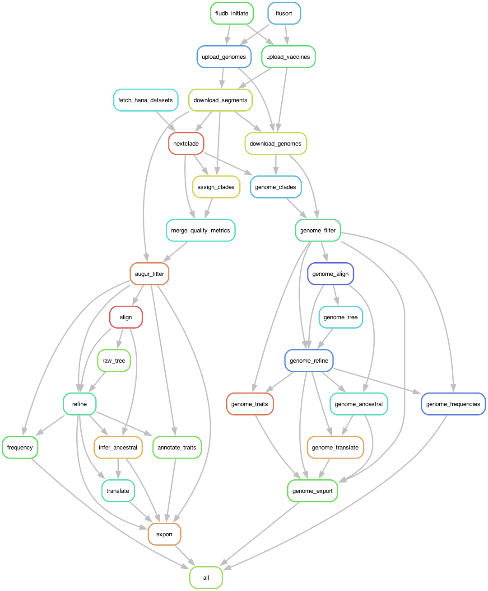

## A couple of notes 

::: {.callout-note} 

This tutorial is optimized to run on machines running MacOS. Users who desire to run this pipeline on Windows must refer to the [WSL installation documentation](https://docs.nextstrain.org/en/latest/install.html) provided by Nextstrain. 

::: 

## What you will accomplish

By the end of this tutorial, you will:

- run the Pekosz Lab influenza Nextstrain workflow on a small teaching dataset;
- build eight segment phylogenies and one concatenated whole genome phylongeny for each subtype;
- create **27 Nextstrain builds** across H1N1, H3N2, and B/Victoria; and
- open the results in Auspice.

The tutorial uses 20 samples per subtype and the same Snakemake workflow used
for a normal production build.

## The (simplified) path from tutorial setup to results


```{mermaid}
%%| echo: false

flowchart LR
    A[Install Dependecies] --> B[Clone the repository]
    B --> C[Supply 3 files]
    C --> D[Enter Nextstrain shell]
    D --> E[Dry run]
    E --> F[Run Snakemake]
    F --> G[View in Auspice]
```

- This pipeline requires only 3 input files to run: 
  - vaccines.fasta
  - sequences.fasta
  - metadata.fasta

:::{.callout-warning}
You **must** run every command from the repository's top-level `nextstrain/` directory.
:::

## Before you begin: Install Dependencies

You need:

- macOS
- an internet connection (to download [clades](https://github.com/influenza-clade-nomenclature));
- [Docker Desktop](https://docs.docker.com/get-started/get-docker/);
- the [Nextstrain command-line Interface (CLI)](https://docs.nextstrain.org/en/latest/install.html);
- this [Pekosz Lab Nextstrain repository](https://github.com/Pekosz-Lab/nextstrain); and
- a terminal or IDE—[Positron](https://positron.posit.co/download.html) is
  recommended.

The workflow downloads current Nextclade datasets during the run.

::: {.notes}
[Sources]

- https://docs.docker.com/get-started/get-docker/
- https://docs.nextstrain.org/en/latest/install.html
- https://positron.posit.co/download.html
:::

## Install and start Docker

1. Install [Docker Desktop](https://docs.docker.com/desktop/) for your operating
   system.
2. Start Docker Desktop.
3. Wait until the Docker engine reports that it is running.
4. Verify it from a terminal:

```shell
docker run --rm hello-world
```

If the command cannot connect, reopen Docker Desktop and wait for startup to
finish.

::: {.notes}
[Sources]

- https://docs.docker.com/desktop/
:::

## Positron keeps the workflow in one window

1. Install [Positron](https://positron.posit.co/download.html).
2. Select **Terminal > New Terminal**.
3. Navigate to your desired repository location

```shell
cd ~
cd Documents/
```

4. Clone the repository if you do not already have it:

```shell
git clone https://github.com/Pekosz-Lab/nextstrain.git
cd nextstrain
```

5. In Positron, select **File > Open Folder**.
6. Open the top-level `nextstrain` repository folder.
  - All commands that follow assume this is your current directory.

::: {.notes}
[Sources]

- https://positron.posit.co/download.html
:::

## Vaccine GISAID sequences must come from the user

`vaccines.fasta` is not distributed with the tutorial because GISAID data
cannot be openly shared.

Using your own authorized GISAID access:

1. Download and format the vaccine sequences.
2. Save the file as `tutorial/vaccines.fasta`.
3. Do not commit or publicly share it.

Header requirements are documented in the
[vaccine tutorial](https://github.com/Pekosz-Lab/nextstrain#tutorial-add-vaccine-strains-from-gisaid).

## No vaccine data? Use an empty placeholder

The workflow can run without vaccine references, but the expected file must
still exist:

```shell
touch tutorial/vaccines.fasta
```

An empty file produces the clinical tutorial builds without adding vaccine
strains.

Confirm all three inputs:

```shell
ls -lh tutorial/JHH_sequences.fasta tutorial/JHH_metadata.txt tutorial/vaccines.fasta
```

## Verify the Nextstrain runtime

Install the Nextstrain CLI using the
[official guide](https://docs.nextstrain.org/en/latest/install.html), then
check that the Docker runtime is supported:

```shell
nextstrain check-setup
```

You should see seomthing like this
```shell
❯ nextstrain check-setup
Checking for newer versions of Nextstrain CLI…

Nextstrain CLI is up to date!

Testing your setup…

# Checking docker…
✔ yes: docker is installed
✔ yes: docker run works
✔ yes: containers have access to >2 GiB of memory (limit is 7.7 GiB)
✔ yes: image is new enough for this CLI version
✔ yes: Rosetta 2 is enabled for faster execution (optional)
# docker is supported
```

Docker Desktop must remain open while you use Nextstrain.

::: {.notes}
[Sources]

- https://docs.nextstrain.org/en/latest/install.html
- https://docs.nextstrain.org/projects/cli/en/stable/commands/check-setup/
:::

## Enter the reproducible environment

From the repository root:

```shell
nextstrain shell .
```

Look for:

```text
Entering the Nextstrain runtime (docker)
```

Then confirm Snakemake is available:

```shell
snakemake --version
```

Keep this shell open for the remaining steps.

::: {.notes}
[Sources]

- https://docs.nextstrain.org/projects/cli/en/stable/commands/shell/
:::

## Check the workflow before running it

Perform a dry run inside the Nextstrain shell:

```shell
snakemake --dry-run --cores 8 --configfile config/tutorial.yaml
```

A dry run:

- checks the workflow graph;
- confirms that required input paths resolve; and
- does not create the builds.

Resolve any missing-file error before continuing.

## Execute the tutorial

Inside the Nextstrain shell, run:

```shell
snakemake --cores 8 --configfile config/tutorial.yaml
```

- `snakemake` starts the workflow.
- `--cores 8` allows **up to** eight CPU cores. Scale as needed
- `--configfile config/tutorial.yaml` selects tutorial inputs instead of
  `source/` inputs.

:::{.callout-note}
The tutorial produces all 24 segment builds and three whole-genome builds. It
uses the same workflow as a normal production run, but reads its starting files
from this `tutorial/` directory.
::: 

## What Snakemake does for you (breifly)

```{mermaid}
%%| echo: false
%%| 
flowchart LR
    A[classify segments] --> B[organize]
    B --> C[call clades]
    C --> D[filter]
    D --> E[align]
    E --> F[build, refine, annotate trees]
    F --> G[Export Auspice JSON]
```

:::{.callout-warning}
Do not close the terminal or stop Docker during the build.
::: 

The Snakemake rules for the segment and genome nextstrain builds are as follows:

- Main File: [Snakemake](https://github.com/Pekosz-Lab/nextstrain/blob/main/Snakefile)
- "Parts of a Whole" Files: 
  - [ingest.smk](https://github.com/Pekosz-Lab/nextstrain/blob/main/workflow/snakemake_rules/ingest.smk)
  - [segments.smk](https://github.com/Pekosz-Lab/nextstrain/blob/main/workflow/snakemake_rules/segments.smk)
  - [genomes.smk](https://github.com/Pekosz-Lab/nextstrain/blob/main/workflow/snakemake_rules/genomes.smk)

To generally learn more about Snakemake refer to [https://snakemake.github.io/](https://snakemake.github.io/)

## What Snakemake does for you ([source](https://github.com/Pekosz-Lab/nextstrain/blob/main/rulegraph.png))




## Successful output has three branches

When the workflow finishes, inspect:

```text
auspice/
├── h1n1/
├── h3n2/
└── vic/
```

Each subtype directory contains:

- eight segment JSON builds;
- one whole-genome JSON build; and
- matching tip-frequency JSON files ([sidecar](https://docs.nextstrain.org/en/latest/reference/data-formats.html#data-formats-json) file)

No red error message at the end means Snakemake completed successfully.

## View a build at auspice.us

1. Open [auspice.us](https://auspice.us/) in a browser.
2. Choose **Drag & drop files**.
3. Drag one build JSON and its matching tip-frequency JSON onto the page.

Example for the H1N1 HA build:

```text
auspice/h1n1/ha.json
auspice/h1n1/ha_tip-frequencies.json
```

Reload your web browser and repeat with any segment or genome build you want to explore.

::: {.notes}
[Sources]

- https://auspice.us/
:::

## Interrupted runs can continue

After correcting the cause of an interruption, rerun:

```shell
snakemake --cores 8 \
  --configfile config/tutorial.yaml \
  --rerun-incomplete
```

Snakemake reuses completed outputs and continues unfinished work.

Common checks:

- Is Docker Desktop running?
- Are you inside `nextstrain shell .`?
- Does `tutorial/vaccines.fasta` exist?
- Are you in the repository root?

## Ready for a new run? Keep tutorial and production runs separate!

Both modes use the same downstream locations:

```text
data/  results/  logs/  auspice/  fludb.db
```

Use a fresh checkout or a clean workspace when switching modes.

To archive and clean an existing build:

```shell
snakemake --cores 8 snapshot_clean
```

This command removes build outputs after archiving them. Review the main
README before using it.

## The complete command sequence

```shell
# On the host
nextstrain check-setup
nextstrain shell .

# Inside the Nextstrain shell
snakemake --dry-run --cores 8 \
  --configfile config/tutorial.yaml

snakemake --cores 8 \
  --configfile config/tutorial.yaml
```

Then open [auspice.us](https://auspice.us/) and load a matching pair of JSON
files from `auspice/<subtype>/`.

## You are ready to build

The tutorial is reproducible when four conditions are true:

1. Docker is running.
2. The three tutorial input files exist.
3. Commands run inside `nextstrain shell .`.
4. `config/tutorial.yaml` is selected.

Start with a dry run, then let Snakemake build all 27 influenza views.

## Additional Resources

1. This tutorial is based on the Pekosz Lab [Nextstrain README documentation](https://github.com/Pekosz-Lab/nextstrain/blob/main/README.md)
2. A written tutorial can be found [HERE](../tutorial.qmd)

### Relevant Links
- The Pekosz lab Nextstrain Github: [https://github.com/Pekosz-Lab/nextstrain](https://github.com/Pekosz-Lab/nextstrain)
- The Pekosz lab Nextstrain Builds: 
    - **Privately** Hosted for internal meetings: [https://nextstrain.org/groups/PekoszLab](https://nextstrain.org/groups/PekoszLab)
    - **Publically** Hosted for publications: [https://nextstrain.org/groups/PekoszLab-Public](https://nextstrain.org/groups/PekoszLab-Public)

[Back to the blog post](https://elginakin.github.io/posts/content/pekosz_nextstrain/)